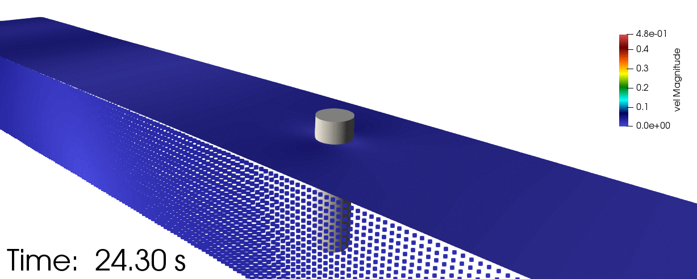

This paper presents new developments in meshless local Petrov-Galerkin with Rankine source (MLPG_R) particle based method for studying interaction of waves with fixed structures in a numerical wave-tank. A new 3D formulation of the Lagrangian flow problem for incompressible fluid with optimised solution strategy is presented. The pressure Poisson equation is solved in local weak-form with integration done semi-analytically using a new symmetric expression. The wave-generation is done using one-way coupling with a 2D fully-nonlinear potential theory based finite-element model. Further a simple identification method for free-surface particles is proposed, which is shown to work well in vicinity of the structure. The solid-wall boundary condition is treated using ghost and mirror particles for accurate calculation of gradients. The waterline on domain boundary faces is treated using a tangentially moving side-wall approach which makes this particle based scheme capable of capturing small amplitude waves and focusing waves. The paper briefly presents experimental setup used for studying the interaction of a fixed emergent cylinder with uni-directional regular and focusing waves in 3D. The numerical model is validated against results from this experiment. An analysis is conducted on parameters related to local integration domain, wave-making coupling algorithm, particle distribution and time-step. This work highlights the use of hybrid approach for efficient and accurate simulation of waves-structure interaction.

| Focusing wave impact on monopile |
| --- |
|  |