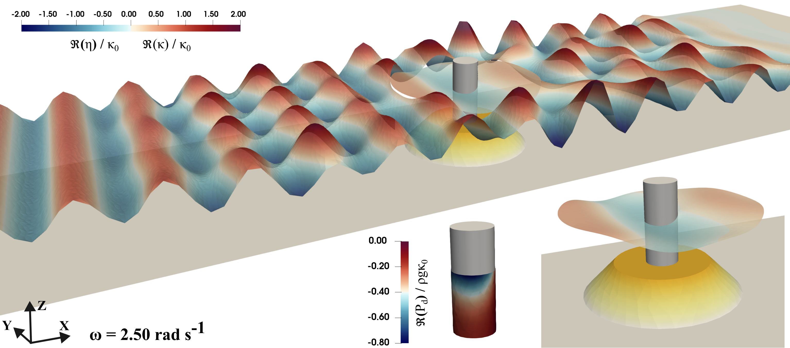

The paper presents a monolithic finite element model for the hydro-visco-elastic analysis of floating membranes interacting with ocean waves. The formulation couples linearised potential flow and viscoelastic membrane equations, offering a versatile tool for modelling arbitrarily shaped floating membranes in varying sea-bed topography. The paper also presents a wet modal analysis for the coupled problem, accounting for the added mass and stiffness of the surrounding fluid. This model is used to study the dependence of the wet natural frequencies of floating membranes on the material properties. It is also used to analyse the reflection, transmission, scattering and absorption of ocean wave energy by 1D and 2D floating membranes. Notably, the paper underscores the impact of proportional material damping on these observed phenomena. The results highlight local peaks in the viscoelastic behaviour at the calculated wet natural frequencies, and demonstrate the outward dispersion of incoming wave around finite 2D membranes. Furthermore, the model is employed to examine the interaction of viscoelastic membranes with other structures, such as a monopile, under the influence of ocean waves. This comprehensive investigation contributes to a deeper understanding of the fluid–structure interaction inherent to certain floating solar, wave-energy converter and floating breakwater technologies.

| Schematic showing partial reflection, absorption and transmission of incoming wave-spectrum by visco-elastic floating membrane with free-ends. |
| --- |
|  |

| Interaction of viscoelastic floating annular ring membrane with monopile |
| --- |
|  |
