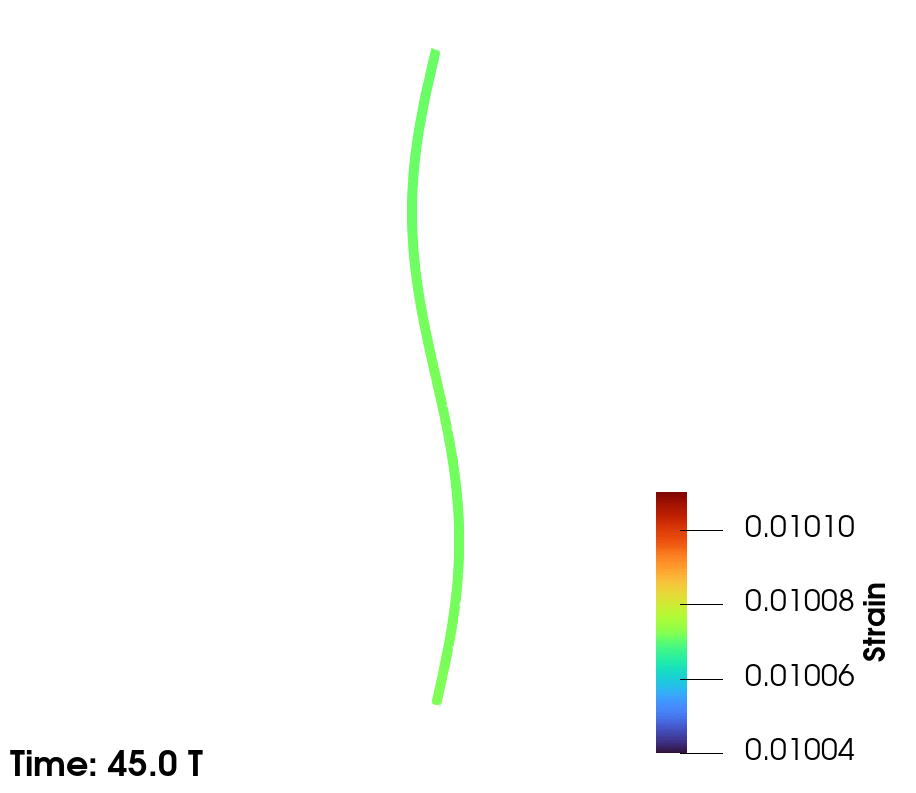
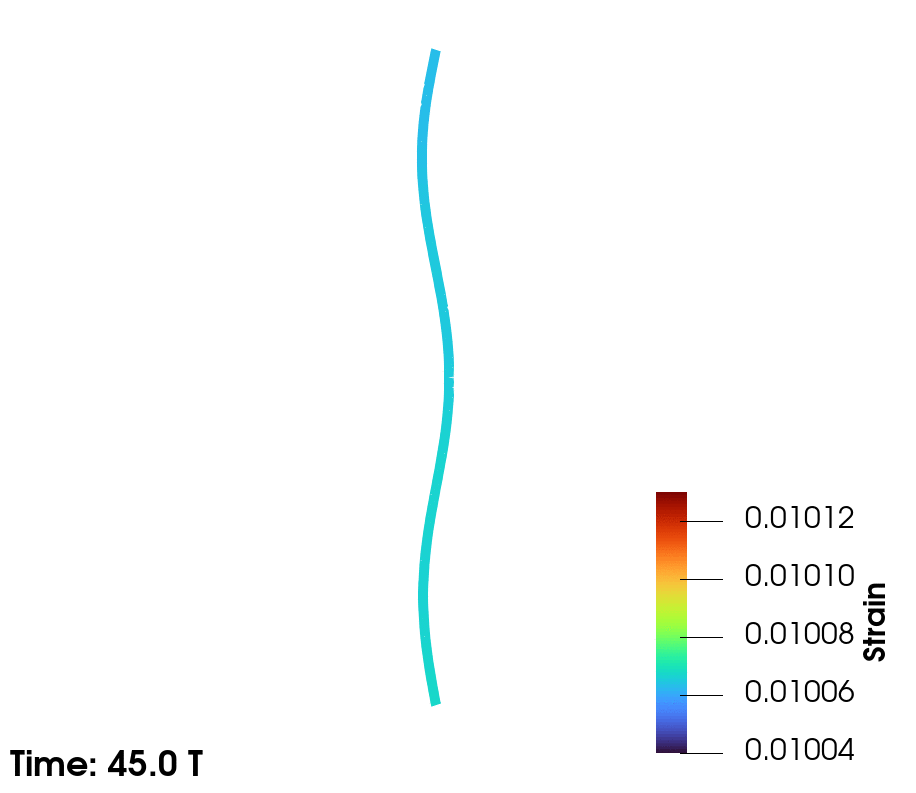
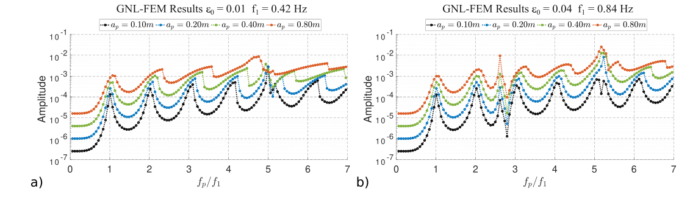

This manuscript presents a formulation for mooring line dynamics using a Tangential Differential Calculus (TDC) framework. The approach handles geometric non-linearities due to both curved shapes and large deformations and is applicable to catenary and taut mooring systems. Defining the boundary value problem using TDC enables a consistent and flexible treatment of partial differential equations on curved domains. The formulation is based on finite-strain theory and includes self-weight, buoyancy, seabed interaction, and hydrodynamic drag.The formulation is numerically modelled using finite element method and implemented in Julia. Mesh and element order convergence studies show optimal performance. The model is validated against standard benchmarks and applied to catenary lines under various excitations, showing good agreement with reference results.A key focus is the dynamic behaviour of taut mooring lines under harmonic transverse excitation. Results emphasize the impact of geometric non-linearity on displacement and strain, which are observed as super-harmonics and sub-harmonics in the strain, with the system's natural frequency gradually increasing with higher excitation frequency and amplitude.The manuscript also introduces a reduced-order analytical model, suitable for low-fidelity preliminary design and optimization of taut lines. It demonstrates good accuracy up to the second natural frequency, even under high pre-tension and excitation.

| Catenary line in JONSWAP sea-state in shallow waters |
| --- |
|  |

| Taut line exhibiting 2nd and 3rd mode |
| --- |
|   |

| Frequency sweep results showing the peak amplitude of the principal strain as a function of the excitation frequency for taut line in periodic excitation |
| --- |
|  |

