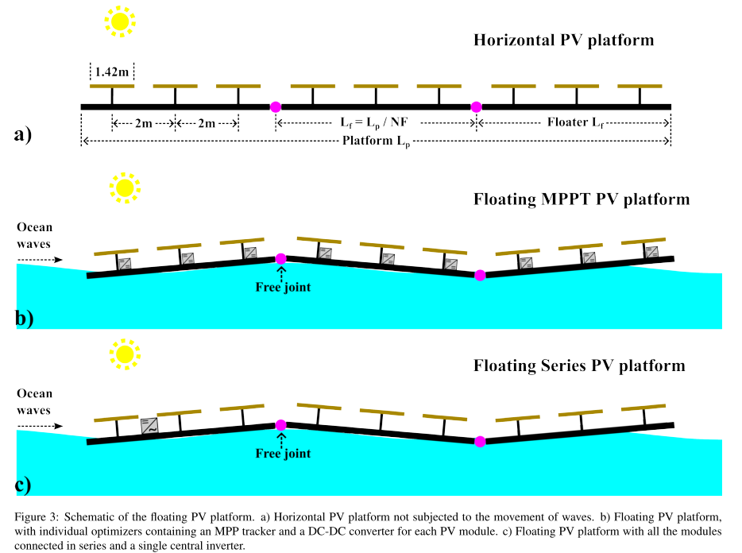

As climate change becomes more critical and renewable energy sources expand, deploying photovoltaic (PV) systems on land faces limitations due to competition with agricultural and housing sectors. The sea offers a promising location for the installation of offshore floating PV (OFPV) systems. For the truly offshore deployment of these systems, an in-depth understanding of the fluid-structure interaction is required. In this work, we aim to contribute to this aspect by exploring how different parameters affect the structural load endured by the floating platform and the related electrical power losses. We employ a multi-physics framework that integrates the mechanical model of a very large floating structure with the optoelectrical modeling of PV modules located on top of the structure. This framework is used to analyze a hypothetical OFPV platform design, which includes a range of floater configurations, from a single large floater to multiple small floaters connected with free hinges. The results reveal a trade-off in selecting the number of floaters. The power mismatch loss tends to be lower for platforms with fewer, longer floaters. However, the structural loads are influenced by the interplay between elastic and rigid body responses, with high stresses observed in longer floaters due to the dominance of the elastic response. We further explore the influence of structural properties on the power mismatch losses. It is observed that the Young's modulus of the material only has an impact for longer floaters where the elastic-response dominates. Conversely, changes in the cross-section fill ratio affect shorter floaters, where the rigid-body response prevails. The floater-beam thickness has the most significant impact across various floater lengths.

| Schematic of the floating photovoltaic platform studied in the manuscript |
| --- |
|  |