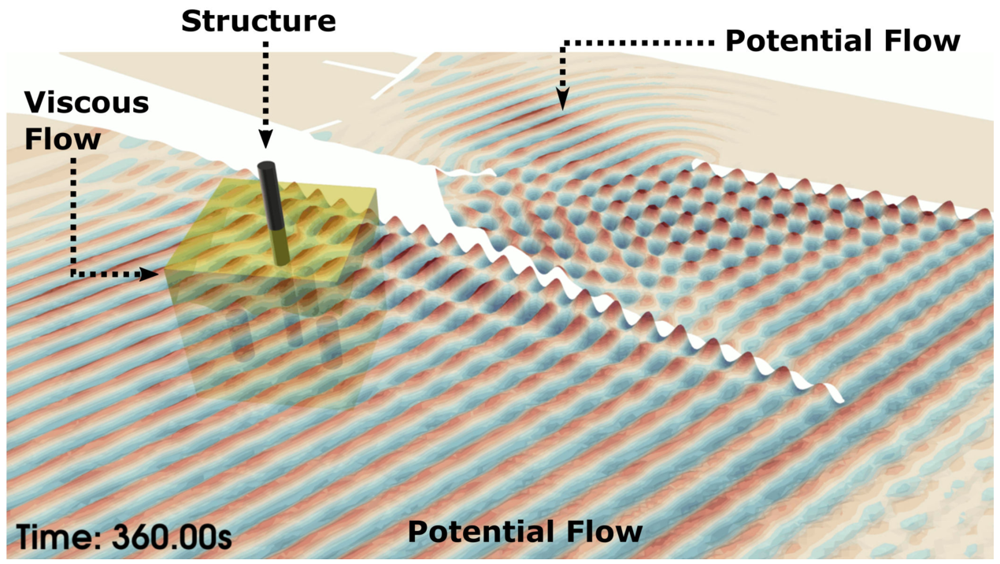

The paper presents coupling between a mesh-based finite-element model for Boussinesq equations (FEBOUSS Agarwal et al., 2022) with a meshless local Petrov–Galerkin model for the Navier–Stokes equations (MLPG_R Agarwal et al., 2021) in 3D. Boussinesq equation models are widely used for simulating wave-propagation over large domains with uneven topography using a 2D surface mesh. Mesh-less models inherently capture large free-surface deformations and have shown promise in simulating wave-structure interaction, run-up and breaking phenomenon. The hybrid approach in this paper assumes a 3D MLPG_R sub-domain surrounded by the 2D mesh of FEBOUSS. The coupling interface in MLPG_R consists of relaxation zones that can be placed along multiple boundaries of the sub-domain for exchanging particle velocity from FEBOUSS. This hybrid model is therefore capable of simulating directional waves, that has not been reported previously. The paper first presents the procedure for calculating the depth-resolved velocities in 3D from the Boussinesq model. The resultant velocities are compared against theory, experiments and other models. The following sections present the coupling algorithm along a single and multiple coupling interfaces in MLPG_R. Validation results for this hybrid model are provided using surface elevation and velocity measurements for regular waves, including directional cases. In general, the results from the hybrid model are reported to have marginal over-prediction of peaks compared to purely MLPG_R simulation. Finally, the interaction of a vertical cylinder with direction regular wave is simulated using the 3D hybrid model.

| 3D Coupling between MLPG and FEBOUSS |
| --- |
|  |

| Schematic highlighting regions of potential flow and viscous flow in the numerical modelling of large-domain, such as Chennai harbour |
| --- |
|  |