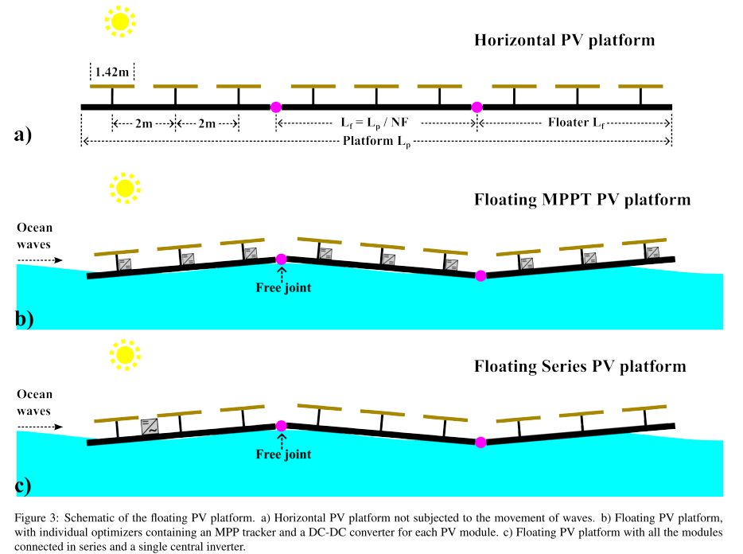

As climate change becomes more critical and renewable energy sources expand, land-based photovoltaic (PV) systems face limitations due to competition with agriculture and housing. The sea offers a promising location for offshore floating PV (OFPV) systems. Understanding fluid–structure interactions is crucial for these systems. This work explores how different parameters affect the structural load on the floating platform and related electrical power losses. We develop a multi-physics framework integrating the mechanical model of a large floating structure with the optoelectrical modeling of PV modules. This framework analyzes a hypothetical OFPV platform design with various floater configurations, from a single large floater to multiple small floaters connected with free hinges. The results reveal a trade-off in the number of floaters. Power mismatch loss is lower for platforms with fewer, longer floaters. However, structural loads vary, with high stresses in longer floaters due to the elastic response. Young’s modulus impacts longer floaters where the elastic response dominates, while cross-section fill ratio affects shorter floaters, where the rigid-body response prevails. The floater-beam thickness has the most significant impact across various floater lengths.

| Schematic of the floating photovoltaic platform studied in the manuscript |
| --- |
|  |